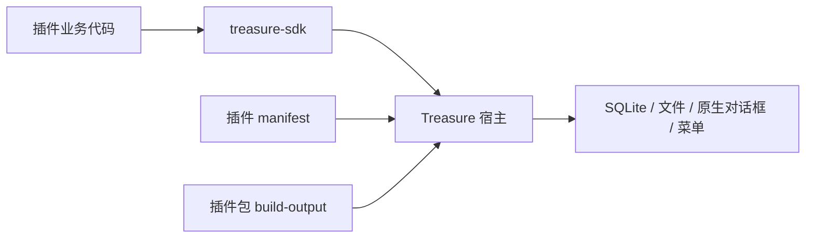

# Treasure Plugins

> Treasure 官方插件源码集合、研发规范与参考实现。

[](https://vuejs.org/)
[](https://vite.dev/)
[](https://github.com/Luzenrocy/treasure-sdk)
[](LICENSE)

`treasure-plugins` 负责规范 Treasure 插件研发、集中管理官方插件源码，并为社区或个人开发者提供可运行的参考实现。它不实现桌面宿主能力，也不定义 SDK 接口；所有插件均通过 [`treasure-sdk`](https://github.com/Luzenrocy/treasure-sdk) 调用 Treasure 桌面应用提供的能力。本文中的“宿主”即该 Treasure 桌面应用。

## 目录

- [仓库职责与边界](#仓库职责与边界)
- [插件研发模型](#插件研发模型)
- [当前插件](#当前插件)
- [目录结构](#目录结构)
- [研发规范](#研发规范)
- [文档导航](#文档导航)
- [关联项目](#关联项目)

## 仓库职责与边界

| 项目 | 职责 |
| --- | --- |
| [Treasure](https://github.com/Luzenrocy/treasure) | 桌面宿主：应用外壳、插件安装与加载、本地数据、安全裁决及原生能力。 |
| [treasure-sdk](https://github.com/Luzenrocy/treasure-sdk) | SDK：公开 API、类型、CLI、桥接协议与 API 参考。 |
| **treasure-plugins** | 本仓库：插件业务源码、插件研发指南、视觉适配参考与插件级说明。 |
| [Tauri v2](https://v2.tauri.app) | Treasure 宿主采用的跨平台桌面运行时。 |

README 只说明本仓库的研发组织与入口。插件功能、产品原型、技术实现和色彩方案必须由各插件目录下的 README 独立维护。

## 插件研发模型



每个插件都是 Vue + Vite 项目，并只有两种接入/调试路径：

| 路径 | 场景 | 数据与能力 |
| --- | --- | --- |
| 注册调试插件 | 插件执行 `npm run dev`，在 Treasure 中注册开发地址 | 插件由 Treasure iframe 加载，使用真实宿主能力；Treasure 可为已安装应用，也可由源码执行 `npm run tauri -- dev` 启动。 |
| 打包导入 | 生成目录包或 ZIP，在 Treasure 插件中心导入 | 作为正式插件运行。 |

## 当前插件

| 目录 | 插件 | 简介 |
| --- | --- | --- |
| [`shi-yu-lu`](shi-yu-lu/README.md) | 石玉录 | 面向本地 Markdown 文件的笔记编辑与资产管理工具。 |
| [`kao-cheng-ce`](kao-cheng-ce/README.md) | 考成策 | 面向任务、进度、标签、日志与提醒的管理工具。 |
| [`treasure-plugin`](treasure-plugin/README.md) | 插件脚手架 | 可复制的最小插件参考实现，也是 SDK CLI 的模板依据。 |

## 目录结构

```text
treasure-plugins/
├── docs/
│   ├── PLUGIN-DEVELOPMENT-GUIDE.md  # 从创建到发布的插件研发指南
│   └── TREASURE-HOST-DESIGN.md      # Treasure 宿主视觉适配参考
├── treasure-plugin/                 # 最小插件脚手架
├── shi-yu-lu/                       # 石玉录源码与独立 README
└── kao-cheng-ce/                    # 考成策源码与独立 README
```

每个插件目录应至少包含：

```text
<plugin>/
├── src/                 # 页面、组件、业务逻辑与样式
├── public/              # 图标和静态资源
├── scripts/             # 打包、初始化与销毁脚本
├── manifest.json        # 可安装插件元数据
├── index.html           # 插件入口与编码声明
├── package.json
└── README.md            # 该插件的产品、架构、配色与使用说明
```

## 研发规范

- 新插件优先使用 `npx treasure-sdk create <plugin-code>` 创建。`npx` 会按需执行 CLI，生成项目默认会安装其 `package.json` 中声明的 `treasure-sdk`；插件编码必须使用 kebab-case。
- `manifest.json` 与入口页的 `treasure-plugin-code` 必须使用同一插件编码；构建产物使用项目目录名作为发布包名，生成 `build-output/<package-name>/` 与 `<package-name>.zip`。
- 插件只通过 SDK 访问数据、文件、设置、对话框和菜单；不得直接依赖 Treasure 宿主源码或 Tauri API。
- SQL 使用裸表名，并在每条语句中完整声明涉及表；不得使用平台表、手写插件前缀或高风险 DDL。
- 插件色彩可以具备独立产品性格，但需尊重宿主的暖米、紫罗兰与暖金层级，并在各自 README 中记录自己的色彩角色。
- 每次发布前至少完成注册调试插件验证、目录或 ZIP 导入验证、`npm run build` 和 `npm run build:plugin`。

完整要求与检查清单见 [插件研发指南](docs/PLUGIN-DEVELOPMENT-GUIDE.md)。

## 文档导航

| 文档 | 解决的问题 |
| --- | --- |
| [插件研发指南](docs/PLUGIN-DEVELOPMENT-GUIDE.md) | 如何创建、配置、开发、联调、构建与发布插件。 |
| [Treasure 宿主视觉参考](docs/TREASURE-HOST-DESIGN.md) | 插件如何与宿主的布局、颜色和交互层级协调。 |
| [三项目文档迭代记录](docs/DOCUMENTATION-ITERATION-LOG.md) | 每轮修复方案、第三方审查结论、验证证据和源码遗留项。 |
| [第四轮文档审查记录](docs/DOCUMENTATION-REVIEW-ROUND-4.md) | 本轮输入核验、第三方建议、专业评审采纳情况与复审结论。 |
| [第五轮文档审查记录](docs/DOCUMENTATION-REVIEW-ROUND-5.md) | 插件级 README 术语修正和最终复审结论。 |
| [SDK API 参考](https://github.com/Luzenrocy/treasure-sdk/blob/main/docs/API-REFERENCE.md) | SDK 的方法、类型与返回值。 |
| [桥接协议](https://github.com/Luzenrocy/treasure-sdk/blob/main/docs/BRIDGE-PROTOCOL.md) | SDK 与宿主的底层通信契约及兼容性规则。 |

## 关联项目

- [Treasure 宿主](https://github.com/Luzenrocy/treasure)
- [Treasure SDK](https://github.com/Luzenrocy/treasure-sdk)
- [Treasure Plugins](https://github.com/Luzenrocy/treasure-plugins)
- [Tauri v2](https://v2.tauri.app)

本仓库采用 [Apache License 2.0](LICENSE) 许可。
