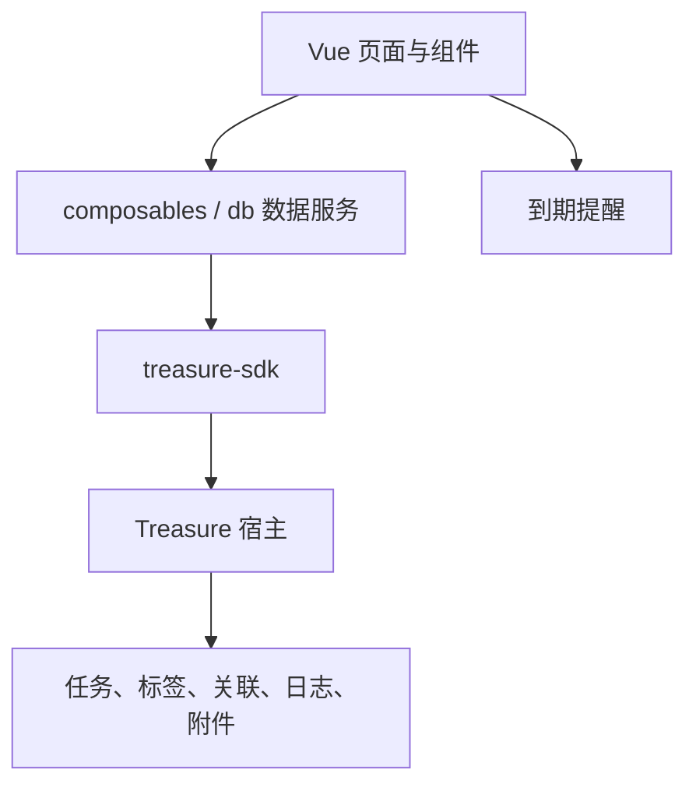

# 考成策

> 用于任务拆解、进度跟踪、标签归类、日志记录与到期提醒的管理插件。

考成策以“任务可分解、过程可记录、进度可回看”为产品原型。它将任务列表、看板、树形层级和统计信息组织在一个工作区中，并通过 Treasure SDK 使用插件私有数据、设置、附件与通知能力。

## 产品原型与核心流程

```text
创建任务
  → 设置优先级、日期、标签与父任务
  → 在列表 / 看板 / 树视图推进状态和进度
  → 记录过程日志与附件
  → 根据设置发出到期提醒并在统计区回看进展
```

| 模块 | 功能 |
| --- | --- |
| 任务视图 | 以列表、看板和树形结构查看、筛选与推进任务。 |
| 任务编辑 | 创建和编辑标题、描述、优先级、状态、进度、日期、父子关系、标签与附件。 |
| 日志时间线 | 为任务追加过程记录，形成可回看的执行轨迹。 |
| 统计与筛选 | 展示待办、进行中、完成、逾期等状态，并按标签或状态聚焦任务。 |
| 提醒 | 基于用户配置的时间和提前天数检查到期任务。 |

## 技术架构与数据模型



核心数据表由 `scripts/init/1.0.0.sql` 初始化：

| 表 | 责任 |
| --- | --- |
| `tasks` | 任务主体、状态、进度、日期、父子结构与软删除。 |
| `tags` | 标签名称与颜色。 |
| `task_tags` | 任务与标签的多对多关系。 |
| `task_logs` | 任务过程日志与排序。 |
| `task_attachments` | 任务附件的路径与元数据。 |

插件在代码中使用裸表名，宿主负责以插件编码隔离实际表名与校验数据访问。

## 色彩方案

考成策延续 Treasure 的温暖表面与文字色阶，但以 Indigo 作为高频操作和进度的功能主色，突出“执行”和“推进”。

| 角色 | 色值 | 使用位置 |
| --- | --- | --- |
| 页面基底 | `#FFF7EA → #F7F2FF → #EEF7FF` | 页面背景与柔和层次。 |
| 主操作 / 进行中 | `#6366F1` | 新建、选中、进度、标签默认色。 |
| 主操作悬停 | `#4F46E5` | 按钮和交互强化。 |
| 成功 / 已完成 | `#22C55E` | 完成状态和完成统计。 |
| 危险 / 逾期 | `#D36C6C` | 删除、逾期和紧急反馈。 |
| 优先级 P1 | `#F97316` | 重要任务。 |
| 中性文字 | `#4B4257` / `#8B7E9A` | 正文与辅助信息。 |

优先级不只依赖颜色：界面同时保留 P0–P3 标识、状态文本和结构位置，保证信息辨识。

## 配置

| 配置 | 默认值 | 用途 |
| --- | --- | --- |
| `reminder_enabled` | `1` | 是否启用到期提醒。 |
| `reminder_times` | `09:30,17:30` | 每日检查提醒的时间点。 |
| `reminder_days_before` | `3` | 到期前开始提醒的天数。 |

## 开发、测试与打包

```bash
npm install
npm run dev
npm run test
npm run build:plugin
```

独立开发用于任务交互与数据逻辑验证；提醒、附件、设置和真实安装包须在 Treasure 宿主中联调。完整研发要求见 [插件研发指南](../docs/PLUGIN-DEVELOPMENT-GUIDE.md)。

## 关联文档

- [插件研发指南](../docs/PLUGIN-DEVELOPMENT-GUIDE.md)
- [Treasure 宿主视觉参考](../docs/TREASURE-HOST-DESIGN.md)
- [SDK API 参考](https://github.com/Luzenrocy/treasure-sdk/blob/main/docs/API-REFERENCE.md)
