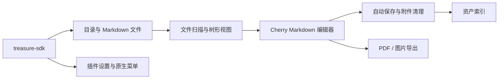

# 石玉录

> 面向本地 Markdown 文件的笔记编辑与资产管理插件。

石玉录将目录中的 Markdown 文件组织为可浏览、可编辑、可导出的笔记工作区。它使用 Cherry Markdown 提供编辑与预览能力，通过 `treasure-sdk` 调用宿主文件、设置、对话框和菜单能力。

## 产品原型与核心流程

```text
选择存储目录
  → 扫描 Markdown 文件树
  → 选择或新建笔记
  → 编辑、自动保存与资产索引维护
  → 需要时导出 PDF 或图片
```

| 区域 | 功能 |
| --- | --- |
| 目录侧栏 | 浏览 Markdown 文件树、新建文件/目录、删除、打开右键操作。 |
| 编辑区 | 使用 Cherry Markdown 提供双栏编辑、纯编辑和只读预览模式。 |
| 资产管理 | 保存和清理笔记附件，维护资产引用索引；支持重建索引。 |
| 导出 | 将当前笔记导出为 PDF 或图片。 |
| 原生菜单 | 注册编辑模式、导出和关闭当前文件等上下文菜单能力。 |

## 技术架构



- `src/App.vue`：页面编排、编辑器生命周期、文件树、导出与菜单协作。
- `src/utils/fileScanner.ts`：扫描与构建 Markdown 文件树。
- `src/utils/assetStorage.ts`、`assetIndex.ts`、`assetCleanup.ts`：附件存储、索引重建与删除清理。
- `scripts/`：插件包构建及生命周期脚本；当前版本不维护自建业务表。

## 色彩方案

石玉录使用与 Treasure 协调的“暖米纸张 + 紫墨强调”方案，突出安静阅读与长期书写。

| 角色 | 色值 | 使用位置 |
| --- | --- | --- |
| 页面纸张底 | `#FFF7EA → #F7F2FF → #EEF7FF` | 编辑器与欢迎区的低饱和渐变基底。 |
| 主文字 | `#4F463B` / `#554D43` | 标题、笔记内容与关键文字。 |
| 紫色交互 | `#7656A7` / `#9A84BD` | 选中态、工具图标与操作反馈。 |
| 装饰渐变 | `#FFB978 → #B69CFF` | 细分隔线和有限强调。 |
| 危险操作 | `#D36C6C` | 删除与错误提示。 |

深色导航属于宿主外壳，石玉录仅在自身页面内使用柔和的米色、紫灰与低对比度边界，避免产生第二层强导航。

## 配置与数据

| 配置 | 用途 |
| --- | --- |
| `storage_dir` | 用户选择的 Markdown 文件存储目录。 |

笔记正文与附件存储在用户选择的目录中，不复制进插件数据库。插件通过 SDK 请求文件操作；资产索引用于判断附件引用并辅助安全清理。

## 开发、联调与打包

```bash
npm install
npm run dev

# 构建和生成插件目录包
npm run build:plugin
```

独立模式用于调试界面和常规逻辑；涉及真实目录、附件、导出、原生菜单或设置时，应在 Treasure 中通过调试入口或导入包完成联调。完整流程见 [插件研发指南](../docs/PLUGIN-DEVELOPMENT-GUIDE.md)。

## 关联文档

- [插件研发指南](../docs/PLUGIN-DEVELOPMENT-GUIDE.md)
- [Treasure 宿主视觉参考](../docs/TREASURE-HOST-DESIGN.md)
- [SDK API 参考](https://github.com/Luzenrocy/treasure-sdk/blob/main/docs/API-REFERENCE.md)
